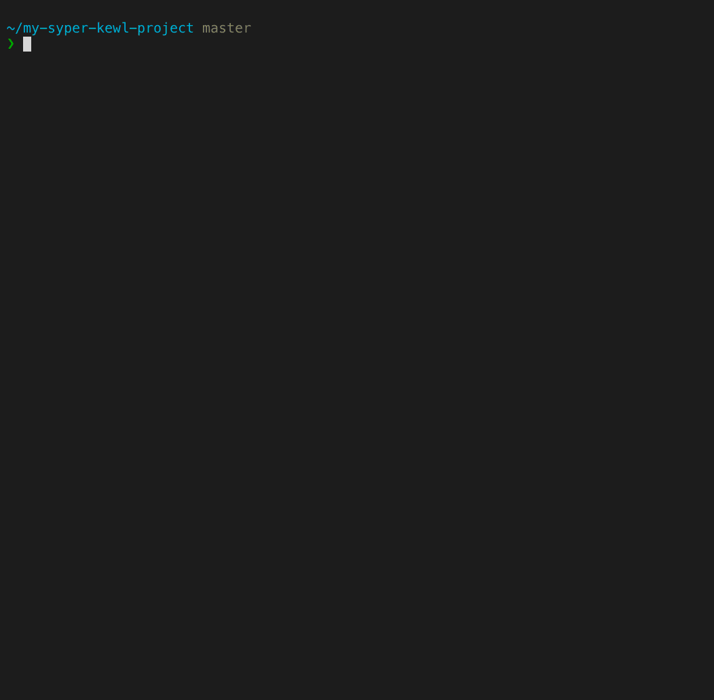

# @343dev/harold


[](https://www.npmjs.com/package/@343dev/harold)

**Harold** — CLI-утилита для сравнения размеров сборок фронтенд-проекта.

## Мотивация

Размер бандла среднестатистического фронтенд-проекта растёт с каждым изменением.

Чтобы ~~прочувствовать боль~~ облегчить сравнение размеров до и после рефакторинга, обновления зависимостей
или каких-то масштабных правок, мы создали Гарольда.

## Демо



<small><i>Демо ускорено в несколько десятков раз. В реальной жизни установка зависимостей и сборка проекта занимают
примерно вечность.</i></small>

## Установка

```bash
npm install -g @343dev/harold
```

## Команды

### snapshot \[options\]

Собирает проект, и создаёт слепок сборки.

Доступные флаги:

- `-c, --config <path>` — указывает путь до файла конфигурации, переопределяет [конфиг по умолчанию](./.haroldrc.js);
- `-o, --output <path>` — указывает путь, по которому нужно сохранить слепок; по умолчанию `harold_snapshot_<date>_<time>.json`;
- `-e, --exec <cmd>` — указывает команду для сборки проекта; по умолчанию `npm run build-production`;
- `-p, --path <path>` — указывает путь до результирующей директории сборки, слепок которой будет сделан; по умолчанию `public`.

### diff \<left\> \<right\>

Сравнивает указанные слепки.

### help

Выводит справку по командам.

## Конфигурация

Настройки по умолчанию расположены в [.haroldrc.js](./.haroldrc.js), файл содержит список поддерживаемых
параметров и их краткое описание.

При запуске с флагом `--config path/to/.haroldrc.js` будут использоваться настройки из указанного конфигурационного файла.

При обычном запуске, без флага `--config`, будет произведён рекурсивный поиск файла `.haroldrc.js` начиная
с текущей директории и до корня файловой системы. Если файл не найден, то будут применены настройки по умолчанию.

## FAQ

### Как оно работает?

При вызове `harold snapshot` Гарольд запускает сборку проекта, ждёт пока она закончится, после этого идёт в папку
с файлами бандла и записывает размер каждого из них. По пути он ещё и создаёт gzip-версию каждого файла, и записывает
и его размер. После этого собирает всё это в кучу и сохраняет в JSON-файл.

При вызове `harold diff first.json second.json` он сравнивает переданные JSON-файлы и выводит общую статистику.

<details>
  <summary>Пример использования</summary>

  ```bash
  # Переходим в директорию проекта
  $ cd ~/my-syper-kewl-project/

  # Делаем слепок
  $ harold snapshot -o before.json

  # Как-то изменяем проект

  # Делаем ещё слепок
  $ harold snapshot -o after.json

  # Сравниваем слепки
  $ harold diff before.json after.json

  Snapshots:
   Left: 11/10/2020 6:30:56 PM • my-syper-kewl-project • master
   Right: 11/10/2020 6:45:13 PM • my-syper-kewl-project • improvement/framework-update

  Build time:
   16 seconds slower (Left: 129 seconds, Right: 145 seconds)

  Diff by category:
   ————————————————————————————————————————————————————————————————————————————————————
                  before              after               Changes
   ————————————————————————————————————————————————————————————————————————————————————
    CSS           144 kB (23.4 kB)    144 kB (23.4 kB)    No changes
   ————————————————————————————————————————————————————————————————————————————————————
    JavaScript    1.04 MB (270 kB)    1.12 MB (294 kB)    +78.2 kB (+23.7 kB), +1 item
   ————————————————————————————————————————————————————————————————————————————————————
    Images        5.26 MB (5.23 MB)   5.26 MB (5.23 MB)   No changes
   ————————————————————————————————————————————————————————————————————————————————————
    Fonts         159 kB (159 kB)     159 kB (159 kB)     No changes
   ————————————————————————————————————————————————————————————————————————————————————
    Other         127 kB (13.2 kB)    127 kB (13.3 kB)    +364 B (+82 B)
   ————————————————————————————————————————————————————————————————————————————————————

    Total         9.4 MB (7.56 MB)    9.57 MB (7.61 MB)   +169 kB (+52.4 kB), +2 items
   ————————————————————————————————————————————————————————————————————————————————————

  Diff by files:
   m public: +169 kB (+52.4 kB)
   m public/10.js: +16 B (+4 B)
   m public/11.js: -20 B (-3 B)
   + public/12.js: 301 B (143 B)
   m public/3.js: +1.84 kB (+621 B)
   m public/app.js: +4.18 kB (+843 B)
   m public/legacy.10.js: +42 B (+18 B)
   + public/legacy.12.js: 513 B (148 B)
   m public/legacy.3.js: +1.9 kB (+634 B)
   m public/legacy.app.js: +6.83 kB (+1 kB)
   m public/legacy.vendor.js: +81.3 kB (+26.8 kB)
   m public/legacy.vendor.js.LICENSE: +182 B (+41 B)
   m public/vendor.js: +72.2 kB (+22.1 kB)
   m public/vendor.js.LICENSE: +182 B (+41 B)
  ```
</details>

### Как быть с хэшами в именах файлов?

Современные бандлеры умеют добавлять в имена файлов хэши, чтобы улучшать их кэширование. Однако, Гарольд сравнивает
файлы основываясь на их имени. Чтобы улучшить качество пофайлового сравнения, стоит настроить бандлер таким образом,
чтобы он отключал добавление хэшей, если указана переменная окружения, например `NO_HASH`.

### Как снять слепок без сборки проекта?

Передайте в `--exec` какую-нибудь бесполезную команду, вроде `echo`.

## Благодарности

Аватар для репозитория нарисовал [Игорь Гарибальди](http://pandabanda.com/).
